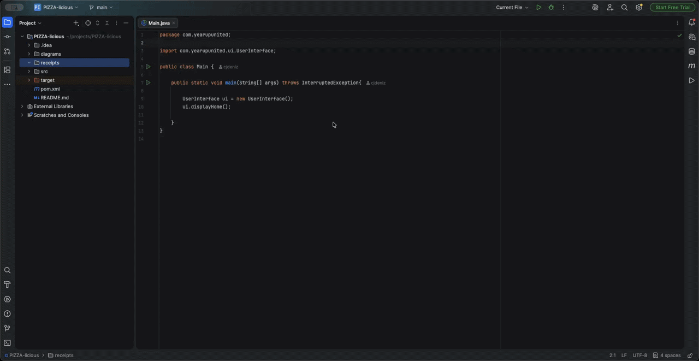

# 🍕 PIZZA-licious — Custom Pizza Ordering System

A Java CLI-based point of sale application for a custom pizza shop where customers can fully customize pizzas, add drinks and garlic knots, and checkout with generated receipt files.

---

# 📋 Table of Contents

* [About](#about)
* [Features](#features)
* [Getting Started](#getting-started)
* [How to Run](#how-to-run)
* [Application Screens](#application-screens)
* [Object-Oriented Programming Concepts](#object-oriented-programming-concepts)
* [Project Structure](#project-structure)
* [Interesting Code Example](#interesting-code-example)
* [Video Demo / Screenshots](#video-demo--screenshots)
* [Technologies Used](#technologies-used)

---

# About

PIZZA-licious is a command-line point of sale application built in Java for a growing custom pizza restaurant. Customers can create fully customized pizzas by selecting crust type, sauces, toppings, stuffed crust options, and pizza sizes. The application also supports drinks, garlic knots, checkout functionality, receipt generation, and customizable signature pizzas.

This project was designed using Object-Oriented Programming principles including inheritance, encapsulation, polymorphism, abstraction, interfaces, and generics.

---

# Features

* Create fully customized pizzas
* Multiple pizza sizes:

    * Personal (8")
    * Medium (12")
    * Large (16")
* Multiple crust types:

    * Thin
    * Regular
    * Thick
    * Cauliflower
* Add sauces and toppings
* Premium topping pricing system
* Stuffed crust support
* Add drinks and garlic knots
* Signature pizzas:

    * Margherita
    * Veggie
* Customize signature pizzas by adding/removing toppings
* Dynamic CLI menus with styled UI
* Order total calculation
* Receipt file generation
* Input validation throughout the application

---

# Getting Started

## Prerequisites

* Java 17 or higher
* IntelliJ IDEA (recommended)
* Git

---

## Installation

1. Clone the repository:

```bash
git clone https://github.com/cjdeniz9/PIZZA-licious.git
```

2. Open the project in IntelliJ IDEA

3. Ensure the toppings file exists:

```text
src/main/resources/toppings.txt
```

4. Run the application from `Main.java`

---

# How to Run

1. Open the project in IntelliJ IDEA
2. Navigate to:

```text
src/main/java/com/yearupunited/Main.java
```

3. Run the application
4. Interact with the menus directly through the terminal

---

# Application Screens

## 🏠 Home Screen

```text
[1] New Order
[0] Exit
```

---

## 📦 Order Screen

```text
[1] Add Pizza          [2] Add Drink
[3] Add Garlic Knots   [4] Checkout
[0] Cancel Order
```

---

## 🍕 Add Pizza Screen

```text
[1] Signature Pizza    [2] Custom Pizza
```

---

## ⭐ Signature Pizza Screen

```text
[1] Margherita Pizza   [2] Veggie Pizza
```

Customers can further customize signature pizzas by:

* Adding toppings
* Removing toppings
* Leaving the pizza unchanged

---

## 🧾 Checkout Screen

Displays:
* Order details
* Pizza configurations
* Toppings
* Total price

Options:
* Confirm Order
* Cancel Order

---

# Object-Oriented Programming Concepts

## Inheritance

The application uses inheritance heavily throughout the pizza system.

Example:

* `Pizza` is the abstract base class
* `CustomPizza` and `SignaturePizza` extend `Pizza`
* `MargheritaPizza` and `VeggiePizza` extend `SignaturePizza`

This allows shared pizza behavior while still supporting specialized pizza types.

---

## Polymorphism

Different pizza subclasses are treated as the same `Pizza` type throughout the application.

Example:

```java
Pizza pizza = handlePizzaMenu();
order.addItem(pizza);
```

Whether the pizza is custom or signature-based, the program handles them through the shared `Pizza` abstraction.

---

## Encapsulation

Fields inside classes are kept private/protected and accessed through methods.

Example:

```java
private final String name;
private final ToppingType toppingType;
```

The internal state of objects is protected while still allowing controlled access through getters and methods.

---

## Abstraction

Abstract classes and interfaces are used to define shared behavior.

Example:

* `Pizza` is abstract
* `IMenuItem` defines required methods for menu items

This keeps the design flexible and organized.

---

# Project Structure

```text
## Project Structure

```text
src/
└── main/
    └── java/
        └── com.yearupunited/
            ├── Main.java
            │
            ├── models/
            │   ├── CustomPizza.java
            │   ├── Drink.java
            │   ├── GarlicKnots.java
            │   ├── MargheritaPizza.java
            │   ├── Order.java
            │   ├── Pizza.java
            │   ├── SignaturePizza.java
            │   ├── Topping.java
            │   ├── VeggiePizza.java
            │   │
            │   ├── enums/
            │   │   ├── CrustType.java
            │   │   ├── DrinkSize.java
            │   │   ├── PizzaSize.java
            │   │   ├── SauceType.java
            │   │   └── ToppingType.java
            │   │
            │   ├── interfaces/
            │   │   ├── IDescribable.java
            │   │   ├── ILabelled.java
            │   │   ├── IMenuItem.java
            │   │   └── IPricable.java
            │   │
            │   └── services/
            │       ├── ToppingFileReader.java
            │       └── ToppingManager.java
            │
            └── ui/
                ├── ConsoleStyle.java
                ├── Helper.java
                ├── UserInterface.java
                │
                └── enums/
                    ├── HomeMenuOption.java
                    ├── OrderMenuOption.java
                    └── PizzaMenuOption.java
```

---
# Interesting Code Example

One interesting part of this project is the reusable generic menu selection method used throughout the application.

```java
private <T extends Enum<T> & ILabelled> List<T> selectMultipleFromEnumList(String prompt, T[] options) {
    List<T> selected = new ArrayList<>();

    while (true) {
        System.out.println();
        printScreenHeader(prompt.toUpperCase().replace(":", "").trim());

        for (int i = 0; i < options.length; i++) {
            System.out.println(PADDING + WHITE + "[" + (i + 1) + "]" + GOLD + " " + options[i].getLabel());
        }
        System.out.println(PADDING + WHITE + "[0]" + GOLD + " Done");

        printScreenFooter();

        int choice = readRangeInt(GOLD + "  >> " + WHITE, 0, options.length);
        if (choice == 0) break;

        T selectedOption = options[choice - 1];

        if (!selected.contains(selectedOption)) {
            selected.add(selectedOption);
            System.out.println(WHITE + "  ✓ " + selectedOption.getLabel() + " added." + RESET);
        } else {
            System.out.println(WHITE + "  ✗ Already selected." + RESET);
        }
    }

    return selected;
}
```

### Why this code is interesting

This method uses Java Generics with bounded type parameters:

```java
<T extends Enum<T> & ILabelled>
```

This allows the same method to work for multiple enums such as:

* Pizza sizes
* Sauce types
* Crust types
* Menu options

while still guaranteeing that every option has a `getLabel()` method.

Benefits:

* Eliminates duplicate menu code
* Improves scalability
* Enforces type safety
* Demonstrates advanced Java generic programming concepts

---

# Video Demo / Screenshots

## 🎥 Application Demo



---

# Technologies Used

* Java 17
* IntelliJ IDEA
* Git & GitHub
* Object-Oriented Programming
* Java Collections Framework
* Java Generics
* File I/O
* ANSI Console Styling
* Enums & Interfaces
